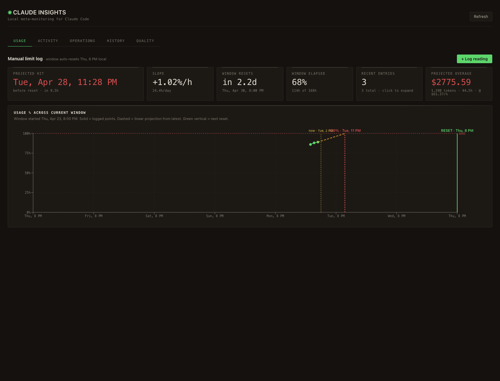
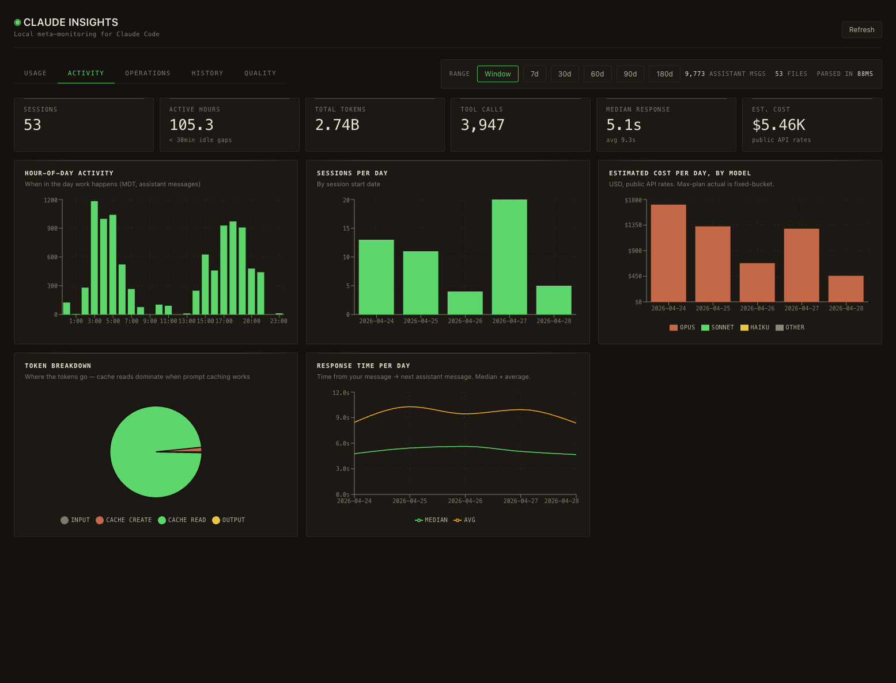
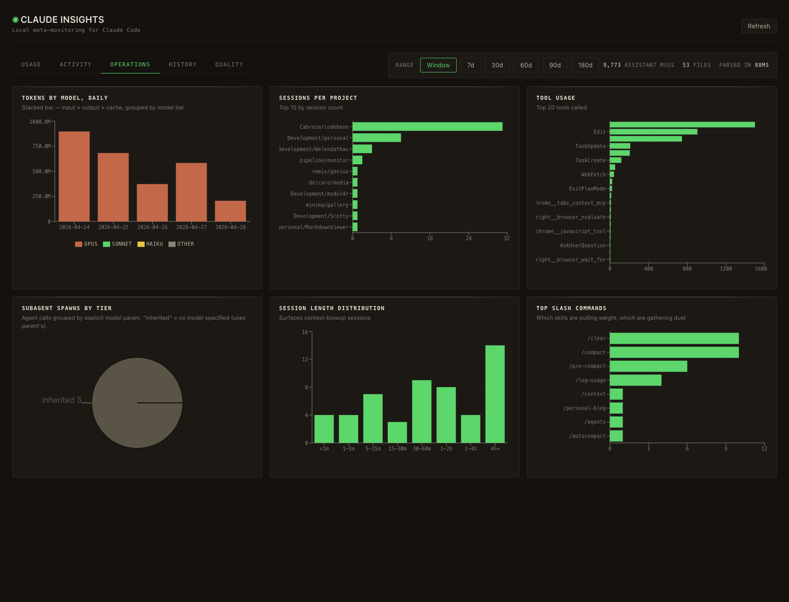
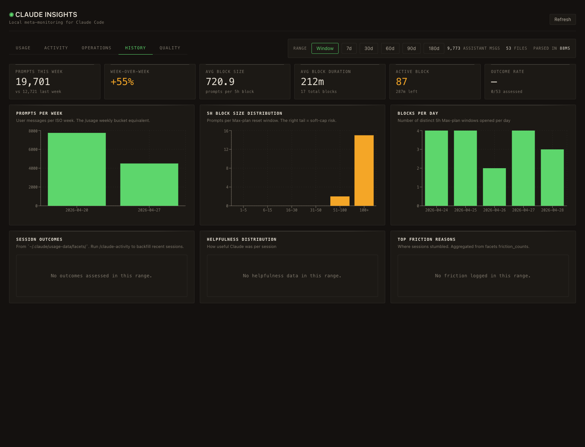
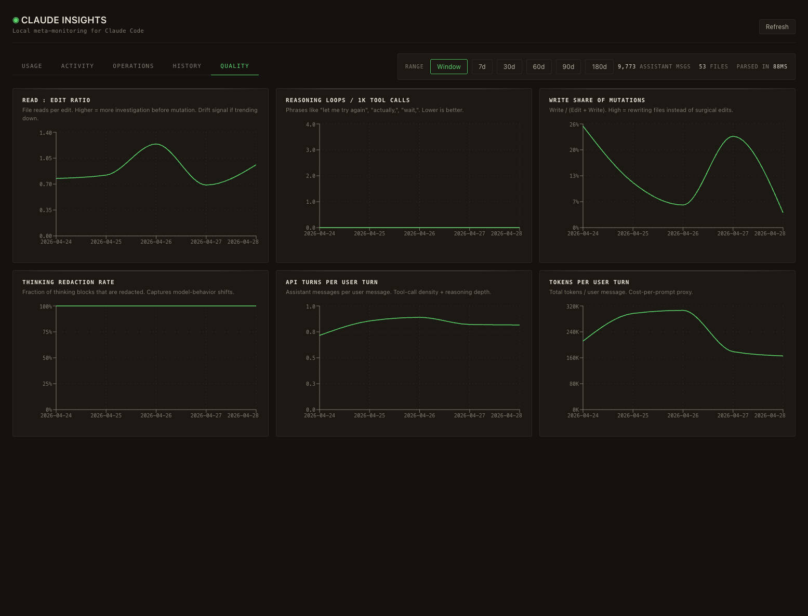

# claude-insights

Local meta-monitoring for Claude Code. Reads the JSONL session logs Claude Code already writes to `~/.claude/projects/`, parses them, and shows operational, quality, activity, and Max-plan usage trends in a dark cockpit-style dashboard. Also includes a manual usage-percent log so you can plot your weekly Max-plan burn against a real reset window and see when you're projected to hit 100%.

No network calls. No account. No telemetry. Runs entirely on data already on your disk.



## What you get

Five tabs. The top four (Activity / Operations / History / Quality) share a date-range filter (`Window` / `7d` / `30d` / `60d` / `90d` / `180d`). The Usage tab is window-immune — it always reflects the rolling Max-plan reset window.

### Usage

Manual limit log + linear projection. Log a percent reading with `/log-usage 47` (slash command, see below) or via the `+ Log reading` button. The dashboard:

- Plots all readings inside the current Max-plan reset window
- Linearly regresses the slope and projects when you'll hit 100%
- Draws a red dashed line at the projected hit time when it lands before reset
- Shows the projected $ overage — derived from real JSONL token cost in this window divided by the latest logged %, so the rate tracks your actual model mix (not a hardcoded guess)

The window auto-slides; you don't reset anything manually.

### Activity

Session count, active hours, total tokens, tool calls, response times, est. cost. Charts for hour-of-day (in your local zone), sessions per day, daily cost by model, token-type breakdown, response-time trend.



### Operations

Tokens by model (daily), sessions per project, tool usage, subagent spawns by tier, session-length distribution, top slash commands.



### History

Prompts per ISO week, 5h-block size distribution (right tail = soft-cap risk), blocks per day, plus session outcomes / helpfulness / friction reasons from `~/.claude/usage-data/facets/` if present.



### Quality

Drift signals inspired by [cc-canary](https://github.com/delta-hq/cc-canary): read:edit ratio, reasoning-loop frequency, write share of mutations, thinking-redaction rate, API turns per user turn, tokens per user turn.



## Manual limit log — `/log-usage`

The Usage tab needs you to feed it readings — one per Claude Code session, give or take. Two ways:

**From the dashboard:** click `+ Log reading`, type the percent you see in Claude Code's status line, save.

**From any terminal:** run the `/log-usage` slash command Claude Code can invoke for you. Drop this file at `~/.claude/commands/log-usage.md`:

```markdown
---
description: Append a Claude Max-plan usage % reading to the local claude-insights log
---

Run /log-usage <percent> [optional note]. Probe `http://localhost:3850/api/health`
first. If healthy, POST to `/api/usage-log`. If the server is offline, append
directly to `~/Documents/Development/personal/claude-insights/data/usage-log.json`
so the entry is never lost. Reject anything outside 0–100.
```

A handful of readings per week is enough to get a meaningful slope.

## Timezone handling

Server aggregations and client formatters auto-detect the local IANA zone via `Intl.DateTimeFormat().resolvedOptions().timeZone`. Activity hour-of-day, daily breakdowns, and the Usage tab's window math all bucket by *your local wall-clock*, not UTC. Override on the server with `APP_TIMEZONE=America/Denver` (or the standard `TZ` env var) if you ever need to pin it explicitly.

## Requirements

- **Node 20+** (uses `fs/promises`, ESM)
- **Claude Code installed and used** (this is what produces the JSONL files at `~/.claude/projects/`)

macOS and Linux work. Windows is untested but should work — Claude Code's project directory layout is the same.

## Quick start

```bash
git clone git@github.com:FatherMarz/claude-insights.git
cd claude-insights
npm install
npm run dev
```

Then open `http://localhost:4747`.

The first load parses all your session JSONLs and may take a couple of seconds. After that, an in-memory mtime cache makes every subsequent load <200ms — only changed/new files get re-parsed.

## What the data is

| Source | What we use it for |
|--------|-------------------|
| `~/.claude/projects/<encoded-project>/*.jsonl` | All operations, quality, activity, and history metrics. One file per session. Dedupes assistant messages on `(message.id, requestId)` so resumed/branched sessions don't double-count. |
| `~/.claude/usage-data/facets/*.json` (optional) | Session outcomes, helpfulness, friction breakdowns on the History tab. Generated externally. If you don't have these, those charts show "no data" and everything else still works. |
| `data/usage-log.json` (created on first reading) | Manual limit log entries — your `%` readings + the configured weekly reset (default Thu 8 PM local). Gitignored, your data only. |

Nothing is uploaded anywhere. The frontend talks to a localhost-only Express server that reads files off your disk.

## Architecture

```
claude-insights/
├── server/              Express on port 3850
│   ├── index.ts         GET /api/data + /api/usage-log endpoints
│   ├── parser.ts        Walks ~/.claude/projects/, parallel reads, mtime cache
│   ├── aggregations.ts  Operations metrics
│   ├── quality.ts       Drift / quality signals
│   ├── activity.ts      KPIs, hour-of-day, cost, response times
│   ├── usage.ts         Weekly prompts + 5h block analysis
│   ├── usage-log.ts     Manual limit log persistence
│   ├── facets.ts        Reads ~/.claude/usage-data/facets/
│   └── zone.ts          Local-timezone bucketing helpers
└── src/                 Vite + React + recharts on port 4747
    ├── App.tsx          Tab switcher + range filter
    ├── lib/window.ts    Max-plan window math (zone-aware)
    ├── tabs/
    │   ├── Usage.tsx
    │   ├── Activity.tsx
    │   ├── Operations.tsx
    │   ├── History.tsx
    │   └── Quality.tsx
    └── styles.css       Mission Control theme — carbon black, phosphor green, copper, canary
```

## Scripts

| Command | What it does |
|---------|--------------|
| `npm run dev` | Server (3850) + Vite (4747) in parallel |
| `npm run server` | Server only |
| `npm run build` | Production build of the frontend |
| `npm run preview` | Preview the production build |

Ports are hard-coded; edit `server/index.ts` (`PORT = 3850`) and `vite.config.ts` (`port: 4747`) if you have conflicts.

## What it doesn't do

- No real-time tail of the current session (refresh to see updates).
- No subscription-state lookup. The Max plan's `/usage` numbers come from Anthropic's API; we approximate via your manual readings + rolling 7-day prompt counts and 5h block analysis from JSONL timestamps.
- No facet generation — we only read existing facets if they're on disk.
- No auth, no multi-user. Localhost only, your machine.

## Inspiration / prior art

- [cc-canary](https://github.com/delta-hq/cc-canary) — drift detection for Claude Code, a one-shot forensic skill. The Quality tab cherry-picks the high-signal metrics and shows them as trends.
- [ccusage](https://github.com/ryoppippi/ccusage) — the dedupe key `(message.id, requestId)` was learned from their parser.
- The `claude-activity` skill that ships in some Claude Code installs — pointed at the same JSONL data and gave the metric vocabulary on the Activity tab.

## License

MIT — see [LICENSE](./LICENSE).
